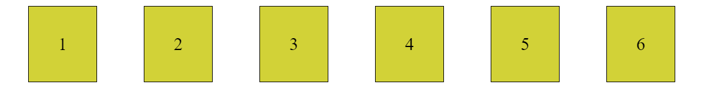
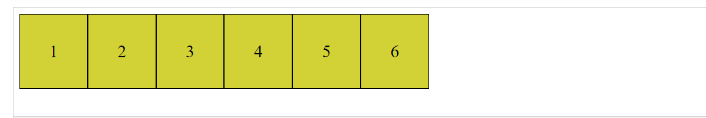
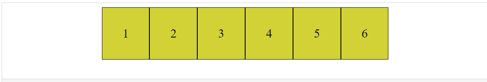
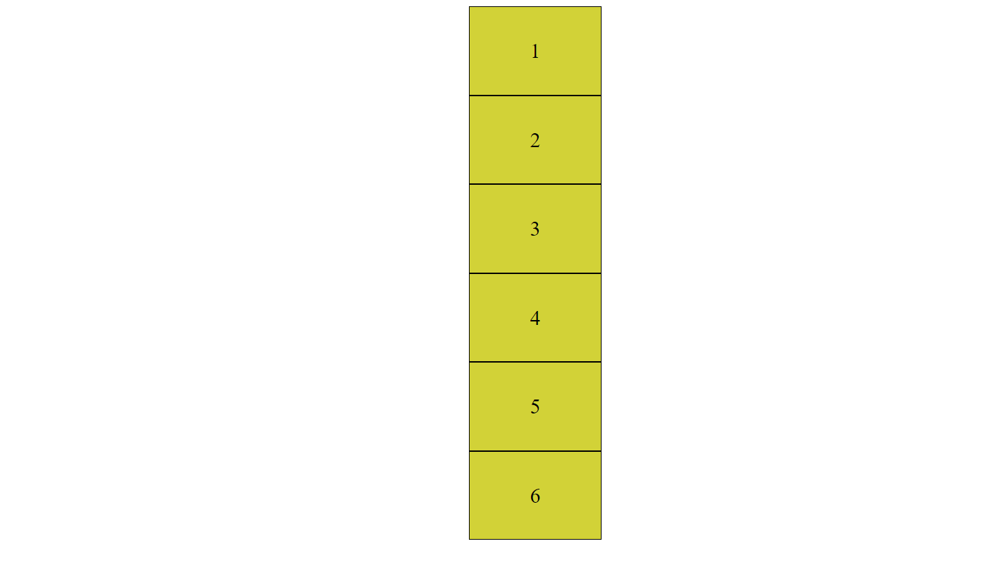

# Introduction to Flexbox

We have seen in the first chapter of the course that traditional layouts come with challenges.

Back in the 90s, tables were used for creating layouts. The problem with tables is that semantically, tables are meant to display tabular data. Tables are not meant for creating layouts, yet, tables were used for this purpose regularly. Tables had their shortcomings too, but we are not detailing them in this course.

Since the invention of modern layouts with inline-block boxes, beginner web developers struggle to understand why it is not intuitive to use inline-block layouts. Advanced developers often cope with this difficulty once, and use their own abstractions or a third-party library to hide the mess during everyday practice.

A recent trend has emerged to clean up the mess present both in CSS and in JavaScript. Lately, developer experience has become an important principle, shaping programming languages to become more user-friendly. Flexbox was born in this era, enhancing CSS3 with a toolset to create flexible web layouts.

Flexbox fully replaces the need to tackle complexity arising from traditional web layouting techniques. You will learn later in this course that Flexbox is simple and intuitive to use.

Let’s start with some definitions.

- Display mode: the model used to display an HTML element. Popular display modes are: block, inline, inline-block, flex, and grid.
- Flex container: an element used for defining the layout of its children. A flexbox container has a display: flex; rule attached to it.
- Flex item: all children of a Flex container are Flex-items. The layout of these elements is determined by the rules applied to the flex container by default. Local overrides can be applied on individual Flex-items with respect to the generic container rules.

> We will use Flexbox container and Flex container as synonyms.

> The terminology suggested by the documentation to denote the children of flex containers is a flex item. This name does not capture the parent-child relationship between flex containers and flex items. Therefore, in this course, we will often use flexbox child elements to refer to flex-items.

Let’s see an example:

```html
<div class="flexbox-container">
  <div class="flexbox-child-element">1</div>
  <div class="flexbox-child-element">2</div>
  <div class="flexbox-child-element">3</div>
  <div class="flexbox-child-element">4</div>
  <div class="flexbox-child-element">5</div>
  <div class="flexbox-child-element">6</div>
</div>
```

The brilliant idea behind Flexbox is that the rules attached to a container influence the layout of its children. The order, size, and gaps between these elements are determined on the container level. This is a lot more intuitive than using `float: right;` or absolute positioning to move individual elements to their intended position. Flexbox looks at a layout as a system, and not as a collection of individual puzzle pieces. However, unlike tables, this system is maintained in CSS, not in the HTML markup.

In this part of the course, we will learn about generic Flexbox container rules. In the next part of this course, we will create individual exceptions to these rules.

Let’s illustrate how simple Flexbox is. So far, don’t concentrate on the underlying CSS. Play around with the example and try to come up with an explanation of why Flexbox is flexible.



[Click here for live DEMO.](https://codesandbox.io/s/clever-ardinghelli-drdyes)

**Question.**

Where does the Flexbox name come from? What does flex mean in Flexbox?

<details> 
<summary>Answer.</summary>
It is not a secret that during the creation of a layout, we work with boxes. However, what does flex mean? Flex stands for flexible. As you change the width of the page, Flexbox containers are resized in a flexible way even though the underlying style declarations are very simple.
</details>

Flexbox is very simple to use. For instance, it is a matter of making one simple change on the container to completely change the layout:


Fig: Flex-start.

**Please click the link below to see live in Code Editor:**

[Click here for live DEMO.](https://codesandbox.io/s/flex-start-rbsno0?file=/style.css)


Fig: Center

**Please click the link below to see live in Code Editor:**

[Click here for live DEMO.](https://codesandbox.io/s/determined-surf-yh863m)


Fig: Flex-direction: column.

**Please click the link below to see live in Code Editor:**

[Click here for live DEMO.](https://codesandbox.io/s/flex-direction-column-u9i67h)
