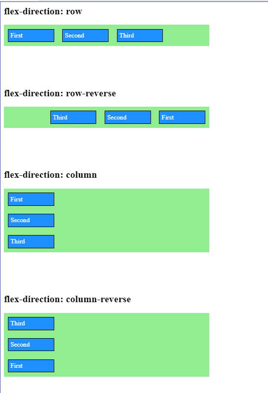

# Introduction

Flexbox uses `flex-direction` to set both the main axis and the cross axis. The `flex-direction` property also sets the order in which flex-items flow inside the flex container.

We have four possible values for the `flex-direction` property:

- `row`: this is the default value, you don’t need to set it manually. Elements flow from left to right. The main axis is horizontal, the cross axis is vertical.
- `row-reverse`: Elements flow from right to left. The main axis is horizontal, and the cross axis is vertical just like in the case of the row value.
- `column`: Elements flow from top to bottom. The main axis is vertical, and the cross axis is horizontal.
- `column-reverse`: Elements flow from bottom to top. The main axis is vertical, the cross axis is horizontal.

Let’s see the four settings in an example. Let’s create three flex-items inside a `flex container.`

```html
<div class="flex-container">
  <div class="flex-item">First</div>
  <div class="flex-item">Second</div>
  <div class="flex-item">Third</div>
</div>
```

Let’s set the container and item sizes to help us focus on the effect of `flex-direction:`



**Please click the link below to see live in Code Editor:**

[Click Here](https://codesandbox.io/s/sharp-wilbur-0ol0s6)

## Notice the following:

- By default, the flex-items are enumerated at the starting position of the main axis (left, right, top, bottom). This behavior symbolizes the default value `justify-content: flex-start;.`
- If the Flex container main axis dimension is set, empty space is left on the side of the container, where the main axis ends. We will distribute this empty space later when learning about `justify-content.`
- The Flex container expands if its main axis dimension is not set. In the third and fourth example, the height increases with the necessary space required to display the three elements.
