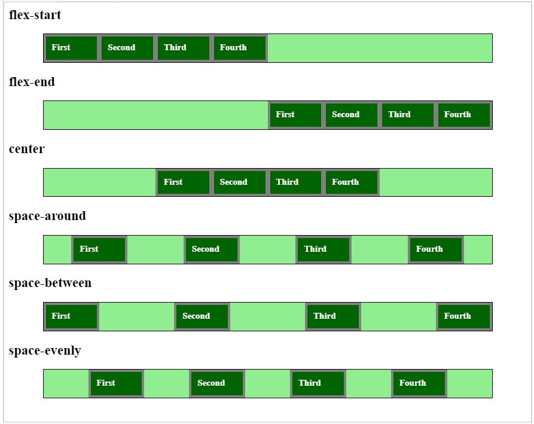

# Introduction

Let’s recall the properties of the main axis and the cross axis of a `Flex container:`

If the `flex-direction` property is `row` or `row-reverse`, the main axis is horizontal. Otherwise, the main axis is vertical.
If the `flex-direction` property is `column` or `column-reverse`, the main axis is vertical. Otherwise, the main axis is horizontal.

> `Justify-content` defines the alignment of flex-items on the main axis of a flex-container.

## The `justify-content` property has the following values:

| Property      | Description                                                                                                                                                                                                                                           |
| ------------- | ----------------------------------------------------------------------------------------------------------------------------------------------------------------------------------------------------------------------------------------------------- |
| flex-start    | Flex-items are aligned to the left of a flex-container. This is the default value of justify-content                                                                                                                                                  |
| flex-end      | Flex-items are aligned to the right of a flex-container.                                                                                                                                                                                              |
| center        | Flex-items are centered inside a flex-container.                                                                                                                                                                                                      |
| space-between | All empty space is equally distributed around each flex item such that the same amount of space is added between adjacent elements. There is no space allocated on the left of the first element and on the right of the last element in a container. |
| space-around  | All empty space is equally distributed around each flex item such that the same amount of empty space is added to the left and to the right of each flex item.                                                                                        |
| space-evenly  | All empty space inside a container is distributed around each flex item such that the same amount of empty space is added between two adjacent elements and before the first element and after the last element.                                      |

Let’s intuitively understand the settings via an example.

```html
<div class="flex-container">
  <div class="flex-item">First</div>
  <div class="flex-item">Second</div>
  <div class="flex-item">Third</div>
  <div class="flex-item">Fourth</div>
</div>
```

We will use the following styles:

```css
.flex-item {
  width: 100px;
  height: 50px;
  background-color: darkgreen;
  color: white;
  font-weight: bold;
  box-sizing: border-box;
  border: 5px solid grey;
  padding: 10px;
}

.flex-container {
  display: flex;
  width: 800px;
  box-sizing: content-box;
  margin: 0 auto;
  border: 1px solid black;
  background-color: lightgreen;
}

.flex-end {
  justify-content: flex-end;
}

.center {
  justify-content: center;
}

.space-between {
  justify-content: space-between;
}

.space-around {
  justify-content: space-around;
}

.space-evenly {
  justify-content: space-evenly;
}
```

Let’s create an example for each justify-content variant:



Please click the following link to see the above output:

[Click Here](https://codesandbox.io/s/magical-carson-0rhib0)
