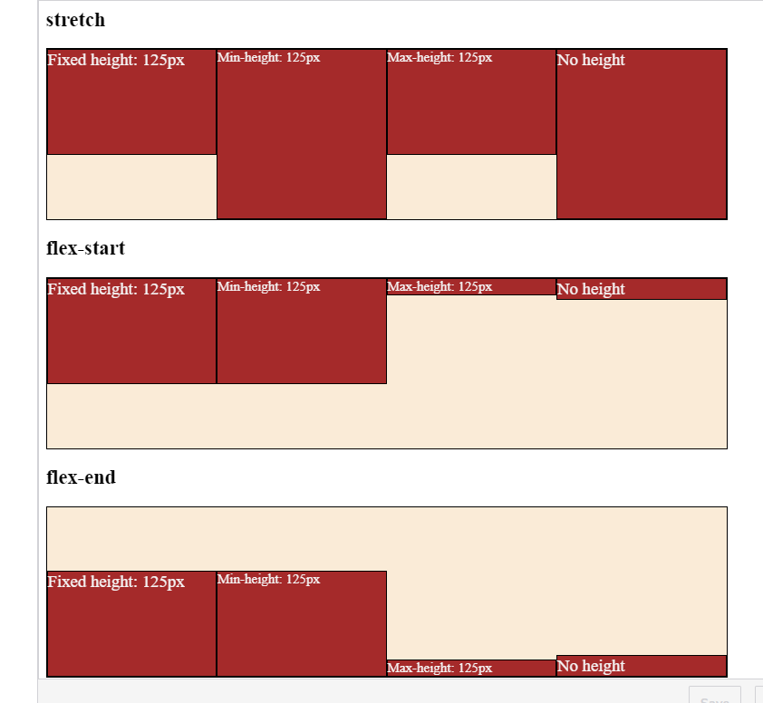
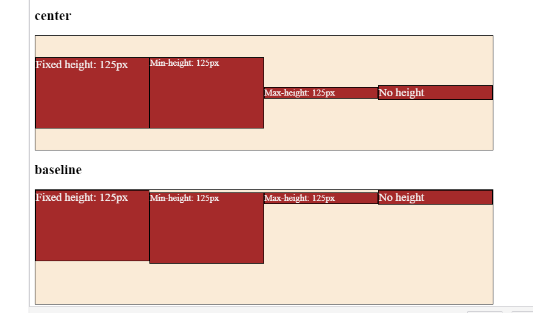

# Introduction

In case of `justify-content`, we may align multiple Flex items that are on a line parallel with the main axis. This is why `space-around`, `space-between`, and `space-evenly` make sense for `justify-content`.

The containers of `align-items` are placed on different lines that are parallel with the main axis. Therefore, even though we align all items on container level, in reality, each element is moved individually, without the influence of other flex-items. Therefore, `space-around`, `space-between`, and `space-evenly` do not make sense for cross-axis movements. We only keep flex-start, flex-end, and center, and introduce some new values:

- `stretch`: this is the default value of `align-items`, which means, you won’t see the `stretch` value often in the code. Stretch stretches each flex-item in the direction of the cross-axis as much as possible.
- `flex-start`: each element is glued to the start of the cross-axis of its container. In the case of a vertical cross-axis, Flex items are moved up to the top of their Flex container. In case of a horizontal cross-axis, Flex items are moved all the way to the left of their container.
- `flex-end`: each element is glued to the end of the cross-axis of its container. In case of a vertical cross-axis, Flex-items are moved to the bottom of their Flex container. In case of a horizontal cross-axis, Flex-items are moved all the way to the right of their container.
- `center`: each element is centered in the direction of the cross-axis, with respect to the space available in their container.
- `baseline`: Flex-items are aligned in the direction of the cross-axis of the container based on their baselines.

## Align-items example

Let’s explore the five options on a horizontal element.

> In the case of align-items: stretch, the height of the Flex-items should not be specified, otherwise stretching won’t work.

Please click the following link to see above results:

[Click Here](https://codesandbox.io/s/relaxed-kirch-gq2krt)

#### Points to Remember.

> Notice the difference between flex-start and baseline: The baseline setting aligns the boxes based on the baseline of their font. If we had the same font sizes in all boxes, flex-start and baseline would produce identical results.
