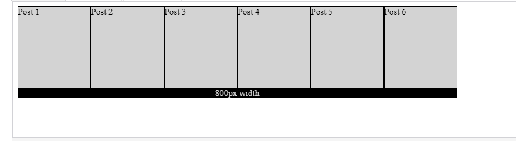

# Introduction

The `flex-wrap` property is a sub-property of the Flexible Box Layout module.

It defines whether the flex items are forced in a single line or can be flowed into multiple lines. If set to multiple lines, it also defines the cross-axis which determines the direction new lines are stacked in.

> Reminder: the cross axis is the axis perpendicular to the main axis. Its direction depends on the main axis direction.

### The `flex-wrap` property can take three possible values:

- `nowrap`

  is the default value. Using this value, Flexbox does not add a line break and fits everything in one line.

- `wrap`:

  adds a line break once you run out of available space. The line breaks happen from top to bottom.

- `wrap-reverse`:

  does the same as wrap except that the order of lines is reversed along the cross axis. The use cases for wrap-reverse are limited, so we will omit examples here to avoid breaking the flow of constructing our blogposts. However, in the flex-flow section, we will demonstrate the usage of wrap-reverse too.

### Challenges with creating multiline grid structure.

When creating a gallery of images or a landing page displaying thumbnails of blog posts, it is a natural phenomenon that we prefer styling each image or post in a container, regardless of whether they are displayed in one line or multiple lines.

The following markup is not intuitive:

```html
<div class="container">
  <div class="row">
    <div class="blogpost">Post 1</div>
    <div class="blogpost">Post 2</div>
    <div class="blogpost">Post 3</div>
  </div>
  <div class="row">
    <div class="blogpost">Post 4</div>
    <div class="blogpost">Post 5</div>
    <div class="blogpost">Post 6</div>
  </div>
</div>
```

The problem with the above markup is that we hardcode the presentation. Using this layout, we have to display all three blogposts in one row. This is not too good when creating responsive layouts.

Therefore, the need arises to create layouts like this:

```html
<div class="container">
  <div class="blogpost">Post 1</div>
  <div class="blogpost">Post 2</div>
  <div class="blogpost">Post 3</div>
  <div class="blogpost">Post 4</div>
  <div class="blogpost">Post 5</div>
  <div class="blogpost">Post 6</div>
</div>
```

Whether these posts are displayed in one column or three-columns, it is a decision we have to take in our CSS files.

Let’s provide some basic styles for our container and our post:

```css
.container {
  display: flex;
  justify-content: space-evenly;
  width: 800px;
}

.blogpost {
  width: 225px;
  height: 150px;
  box-sizing: border-box;
  border: 1px solid black;
  background-color: lightgrey;
}
```

We will also add a black ruler element to measure how wide 800px is.

After displaying these elements, we’ll see the following result:



Fig: 800px width - six blogposts in one line

Please click the link below to see above results:

[Click Here](https://codesandbox.io/s/solitary-pine-fwjr9m)

Now comes a dilemma. We have just experienced an anomaly in that we set the width of each post to be `225px`. If we multiply this number by `6`, we should get `1350px`. However, all six posts fit in just `800px`.

This implies that the width of each post shrinks from `225px` to `800px` / `6` = `133.33px` (rounded to two decimal places).

> When the full width of all elements cannot be displayed in a fixed-width or max-width container, Flexbox items shrink proportionally by default in an attempt to still fit in the available space.

In other words, Flexbox can override the width of a component.

One way to avoid shrinking is to fix the min-width of the Flex-items:

**`Min-width` Example:**

[Click Here](https://codesandbox.io/s/wandering-breeze-wqbvgo)

> The problem with setting the` min-width` is that an `800px` wide container cannot display `1350px` wide content. Therefore, the `min-width` idea does not work and should be omitted.

## Introducing flex-wrap

Another solution is to tell Flexbox to respect the widths of the Flex-items and break them into multiple lines whenever needed. The `flex-wrap: wrap;` container-level property does exactly this.


Please click the link below to see above results:

[Click Here](https://codesandbox.io/s/busy-snowflake-snqf50)

> Although we have not yet created a good-looking layout for these six blogposts, we can still celebrate success: the structure of the layout is now correct. The blogpost items are not distorted either. It is only a matter of vertical margins and some more alignment options to get everything right.
