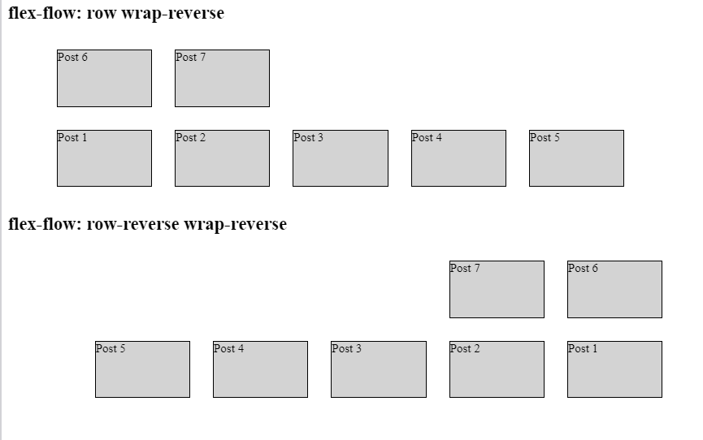

## Introduction

As a reminder, let’s summarize the possible flex-direction and flex-flow values.

**The `flex-direction` property can take four possible values:**

`row`: this is the default value, you don’t need to set it manually. Elements flow from left to right. The main axis is horizontal, the cross axis is vertical.
`row-reverse`: Elements flow from right to left. The main axis is horizontal, and the cross axis is vertical just like in the case of the row value.
`column`: Elements flow from top to bottom. The main axis is vertical, and the cross axis is horizontal.
`column-reverse`: Elements flow from bottom to top. The main axis is vertical and the cross axis is horizontal.

**The `flex-wrap` property can take three possible values:**

`nowrap`: is the default value. Using this value, Flexbox does not add a line break and fits everything in one line.
`wrap`: adds a line break once you run out of available space. The line break happens from top to bottom.
`wrap-reverse`: does the same as wrap except that the order of lines is reversed along the cross axis.

# Introducing flex-flow

Flex-flow: Combining flex-direction and flex-wrap

The `flex-flow` property takes two values:

1. The `flex-direction` property value,
2. The `flex-wrap` property value.

### flex-flow example

We will use the same container as in the previous lesson.

```html
<div class="container">
  <div class="blogpost">Post 1</div>
  <div class="blogpost">Post 2</div>
  <div class="blogpost">Post 3</div>
  <div class="blogpost">Post 4</div>
  <div class="blogpost">Post 5</div>
  <div class="blogpost">Post 6</div>
  <div class="blogpost">Post 7</div>
</div>
```

We will not use breakpoints this time. The dimensions of the blog post container shrinks too:

```css
.container {
  display: flex;
  flex-flow: row wrap-reverse;
  justify-content: flex-start;
  margin: 0 auto;
  width: 100%;
  max-width: 825px;
}
.blogpost {
  box-sizing: border-box;
  border: 1px solid black;
  background-color: lightgrey;
  width: 100%;
  width: 125px;
  height: 75px;
  margin: 15px;
}
```

Notice the `flex-flow: row wrap-reverse;` rule. This rule is equivalent to:

```css
flex-direction: row;
flex-wrap: wrap-reverse;
```

Obviously, `flex-direction: row;` is optional, because unless we override another value, the default value does not need to be mentioned.

Therefore, we will also add a second variant:

```css
flex-flow: row-reverse wrap-reverse;
```

**Let’s see the example:**



Please click the link below to see above results:

[Click Here.](https://codesandbox.io/s/dark-platform-rmbb81)
