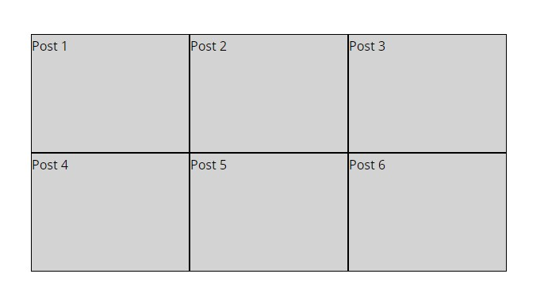
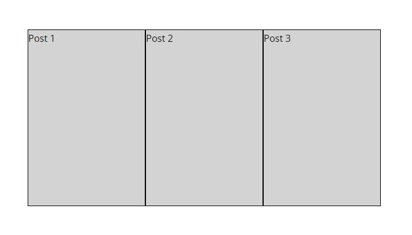
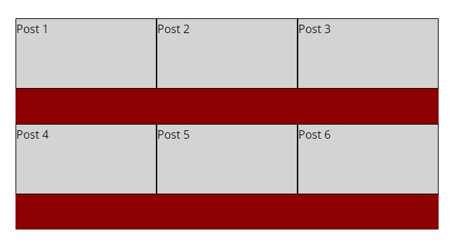
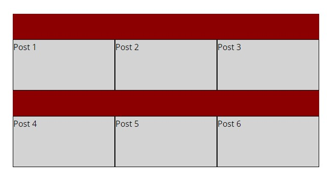
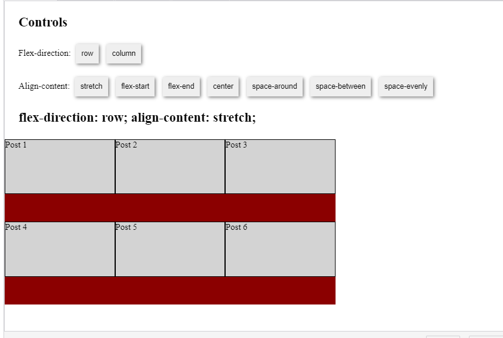

# Introduction

When a flex container has a fixed cross-axis dimension, width, or height, we can decide how we would like to use the available space to display inner content.

> The align-content property is used for wrapped Flexbox content. If you are planning to display one single line or column, use align-items to position your content along the cross-axis.

## Motivation for align-content

Let’s set up a container of six blog posts:

```html
<div class="container">
  <div class="blogpost">Post 1</div>
  <div class="blogpost">Post 2</div>
  <div class="blogpost">Post 3</div>
  <div class="blogpost">Post 4</div>
  <div class="blogpost">Post 5</div>
  <div class="blogpost">Post 6</div>
</div>
```

```css
* {
  margin: 0;
  padding: 0;
  box-sizing: border-box;
}

.container {
  display: flex;
  flex-flow: row wrap;
  width: 600px;
  height: 300px;
  background-color: darkred;
}

.blogpost {
  border: 1px solid black;
  background-color: lightgrey;
  width: 200px;
}
```


Fig: A container with six blog posts.

As the height of the container is specified, the elements are stretched to fit the container. If we had three items, the height of each item would be `300px` instead of the current `150px`.


Fig:Stretched elements fitting the container.

As a result, we can conclude that regardless of the number of rows we have, the space used to display the internal items is stretched evenly.

Suppose we revert back to six blog posts. What happens if we add a fixed height to each flex-item?

```css
.blogpost {
  border: 1px solid black;
  background-color: lightgrey;
  width: 200px;
  height: 125px;
}
```

Nothing changes from the perspective of allocating space to display the items. However, inside the allocated space, the Flex-items follow the `align-items` property value of the container. As this value is not specified, `align-items` stays `stretch`. Stretch does not change the cross-axis dimension when it is specified. Therefore, the blog posts are displayed at the top of their available space.

This behavior results in a `50px` empty darkred space below each blog post:


Fig:Flexbox items with decreased height and align-content: flex-start.

When align-items is specified, we can move the blog post items within their allocated space.

For instance, with `align-items: flex-end` specified on the container, we get the following layout:


Fig:Flexbox items with decreased height and align-content: flex-end.

This does not change the fact that there is `150px` space allocated for each post. We can move the posts within their containers, but we cannot move the available space globally.

## Defining the `align-content` container property

The align-content property helps you control the space allocated for wrapped rows or columns of Flex containers.

Align-content positions empty space not allocated for a wrapped container along the cross-axis.

**Possible values:**

- `stretch`: default value. Content is stretched along the cross-axis to occupy all the space.
- `flex-start`: Content is displayed at the start of the container. All empty space is moved to the end of the container.
- `flex-end`: Content is displayed at the end of the container. All empty space is moved to the start of the container.
- `center`: Content is displayed at the center of the container. All empty space is divided equally and placed around the centered content.
- `space-between`: all empty space is divided between the wrapped content rows or columns along the cross axis.
- `space-around`: equal space is displayed around each wrapped row or column.
- `space-evenly`: equal space is displayed before the first wrapped row/column, after the last row/column, and between two adjacent rows/columns.

Let’s see the six properties in action. Observe all possible combinations by pressing the buttons of this interactive demo:



Please click the link below:

[Click Here](https://codesandbox.io/s/align-content-iu004m)
