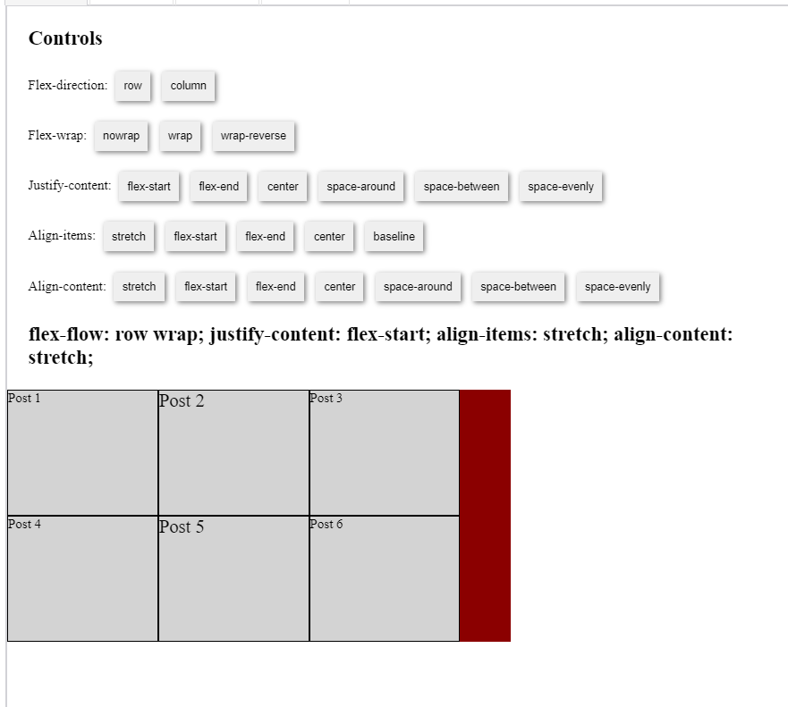

# To Sum Up,

Flexbox containers offer a variety of settings to control the horizontal and vertical alignment, wrapping, and direction of your Flexbox items.

To summarize these settings, check out this demo to play around with different settings.

To demonstrate the effects of changing Flexbox container values, we made flex-wrap: wrap; as the default setting and added a min-width: 180px rule to the six Flex-items. Notice that neither the width, nor the height is set for any of the Flex-items.

**Please click the link below to see the summary in action:**

[(Click here) Flexbox Summary](https://replit.com/@NorbuSherpa/entities#index.html)
