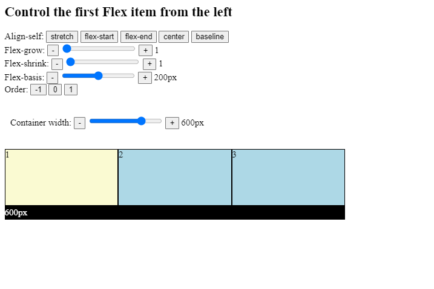

# Introduction

In the previous chapter, we have learned how to set up Flexbox containers. Now it is time to concentrate on the Flexbox items inside a Flexbox container.

Flexbox item properties help us configure item-wide exceptions to alignment rules, and dynamic properties. This helps us influence how each flex item shrinks or grows as space gets scarce.

We will learn the following Flexbox item properties:

- `align-self`,
- `flex-grow`,
- `flex-shrink`,
- `flex-basis`,
- `flex`.

Using the principles of spaced repetition, we will go through many examples that will help us learn Flexbox as a skill in a sustainable way. Spaced repetition is a technique where we keep repeating the same concept at increasing repetition intervals. For instance, if you come across a new concept today then you might consider revising the concept tomorrow or in three days, a week, in three weeks, in two months, etc. The more familiar you are with a concept, the more time you can afford between revisions.

There is no better way to illustrate what we are going to learn than an interactive demo. Feel free to try out the new properties and values to get a feel for what you are about to learn.

Please click the link below:

[Click here](https://codesandbox.io/s/kind-leaf-71y5k0)
