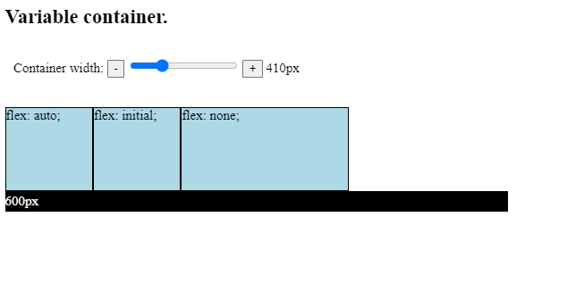

# Flex Shorthand Notation

# Flex

The flex property is a shorthand notation for specifying the `flex-grow`, `flex-shrink`, and `flex-basis` properties in one rule.

The format of `flex` looks as follows:

```css
.flex-item {
  flex: <flex-grow> <flex-shrink> <flex-basis>;
}
```

Example:

```css
.flex-item {
  flex: 2 3 400px;
}
```

The above example is equivalent with the following properties:

```css
.flex-item {
  flex-grow: 2;
  flex-shrink: 3;
  flex-basis: 400px;
}
```

It is important to note that similar to `flex-grow`, `flex-shrink`, and `flex-basis`, `flex` is also applied on individual flex-items.

The `flex` property can take one, two, or three values. We have already examined the version with three values. We will now get to know `flex` rules with one or two property values.

## One value after flex

When only one value is present, most of the time, we influence `flex-grow` only.

In precise terms, whenever the only `flex` property value is one number, then we only specify the `flex-grow` rate with default `flex-shrink` and `flex-basis`. The default value of `flex-shrink` is `1`, while the default value of `flex-basis` is `0`:

```css
.flex-item {
  flex: 2;
}
```

is equivalent to:

```css
.flex-item {
  flex: 2 1 0;
}
```

There are a few other `flex` values that are worth noting:

- `flex: auto;` is fully flexible with a `flex-grow` and `flex-shrink` ratio of 1. It also takes the `flex-basis: auto;` value that sets the basis according to the width and the height of the component.
- `flex: initial;` is equivalent to `flex: 0 1 auto;`. The difference between `initial` and `auto` is that `flex`: `initial` does not grow with the container. It only shrinks to fit in the container.
- `flex: none;` is fully inflexible. This implies a `flex-grow` and `flex-shrink` of `0`, while the `flex-basis` is `auto`.

`For example:` Suppose we have a Flex-container with variable width, and three flex-items with a base width of `150px`. Let’s see how the elements with different `flex` properties react.



Please click the link below:

[Click here](https://codesandbox.io/s/flex-noq36u)

## Two values after flex.

The format with two values can be interpreted in two ways:

- If the second value is a number, it is interpreted as a `flex-shrink` value.
- If the second value is a valid width or height, then it is interpreted as a `flex-basis` value.

The first value is always `flex-grow`.

Let’s see an example:

```css
.first {
  flex: 2 3;
}

.second {
  flex: 2 300px;
}
```

If we write these rules using their longer notations, we get the following:

```css
.first {
  flex-grow: 2;
  flex-shrink: 3;
}

.second {
  flex-grow: 2;
  flex-basis: 300px;
}
```
