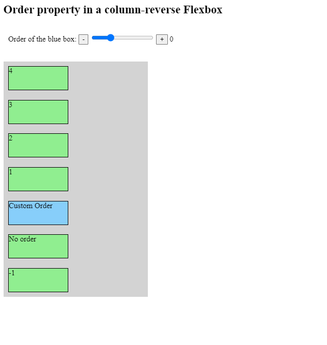

# Ordering flex-items

Similar to the `z-index` property that orders absolutely positioned elements that are stacked on top of each other, we can also order Flexbox items.

The default value of the `order` property is `0`. If we specify a positive or a negative order, we can change the location of a Flex item relative to other items.

For example: suppose we have an elevator. Change the `order` property in the below window to experiment with the `order` property.

Please click the link below:

[Click here](https://codesandbox.io/s/order-0pvxd6)

## Accessibility support

Make sure to use order only in the context of responsive design. In the default screen size, keep the natural order of the flex-items.

If the order of elements is not changed, then screen readers access information in their natural order. By default, foundations for accessibility require that our page should be equally informative with or without CSS. Therefore, the `order` property is only desirable when tweaking our content inside breakpoints.
