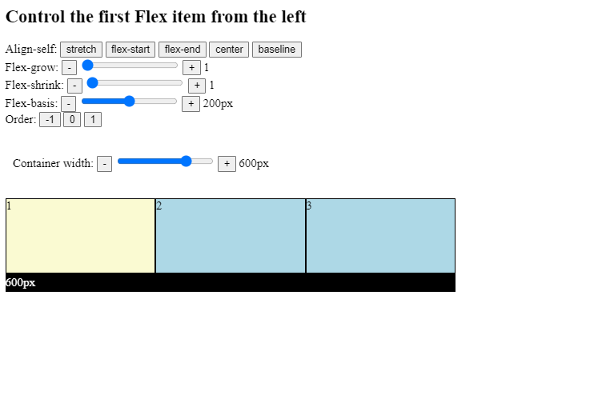

# Aligning Individual Flexbox Items - Summary

### Flex item properties

In this chapter, we learned about the following properties:

`align-self`
`flex-grow`
`flex-shrink`
`flex-basis`
the `flex` shorthand notation,
`order`

All these rules influence a single Flex item. These rules should mainly be used to signal exceptions with respect to the default Flexbox container behavior.

Let’s experiment with these properties in an interactive example:

Please click the link below:

[Click here](https://codesandbox.io/s/flexbox-summary-go6y20)
